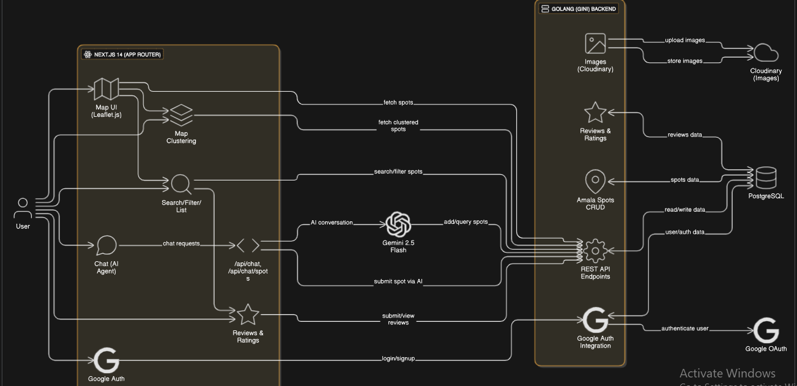

# AmalaJẹun
AmalaJẹun is a crowdsourced global map to discover and verify authentic Amala spots. Features include AI-powered chat/voice intake, duplicate detection, map search with clustering and filters, and autonomous web discovery agents that propose new locations for community verification.
Built with:
- [Next.js](https://nextjs.org/) (App Router)
- [Tailwind CSS](https://tailwindcss.com/)
- [TypeScript](https://www.typescriptlang.org/)
- [Vercel AI SDK](https://sdk.vercel.ai/)
- [Leaflet.js](https://leafletjs.com/) (interactive maps)
- [shadcn/ui](https://ui.shadcn.com/) (UI components)

---

## Getting Started

### 1. Clone the Repository
```bash
git clone https://github.com/JerryJeager/AmalaJeun.git
cd amala-jeun
```

### 2. Install Dependencies 
```bash
npm install
```

### 3. Setup Environment Variables 
Create a .env.local file in the root of the project and add your Google API key:
```bash
GOOGLE_API_KEY=your_google_api_key_here
NEXT_PUBLIC_GOOGLE_MAPS_API_KEY=your-google-maps-key
```

### 4. Run the Development Server
```bash
npm run dev
```

---

## Architecture

[Architecture Diagram](https://app.eraser.io/workspace/SLS0vCUF1kxlaaSSfQ01?origin=share)  


---

## Project Structure

- `/components` - React components (map, chat, dialogs, etc.)
- `/app` - Next.js app router structure
- `/types` - TypeScript types
- `/public` - Static assets
- `/lib` - Utility functions and hooks

---

##  Features

- **Crowdsourced Amala Spot Discovery:** Add, verify, and review Amala spots globally.
- **AI Chatbot:** Ask questions about spots, Add, get recommendations, and more.
- **Map Search & Clustering:** Find spots by location, filter, and cluster view.
- **Image Uploads:** Attach images to spots for better discovery.
- **Community Verification:** Users can verify and review spots.

---

## Backend

The backend for AmalaJẹun is available in a separate repository:  
 [AmalaJeun Backend](https://github.com/Donny-C-1/amalajeun-web-service)  
It provides REST APIs for spots, authentication, image uploads, and more.

---

##  License

MIT License. See [LICENSE](./LICENSE) for details.
